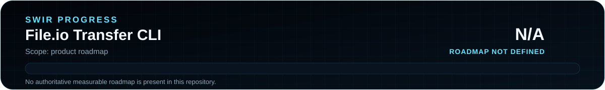

<!-- SWIR-README-STANDARD:v2 -->

<div align="center">


<br>


[](https://github.com/Swir)
[](https://github.com/Swir/File.io_Downloaderup/releases)

[**Highlights**](#-highlights) · [**Quick Start**](#-quick-start) · [**Progress**](#-progress) · [**Releases**](#-releases)

</div>


## 📍 Project Status

<p align="center">
  
</p>

| Item | Status |
|---|---|
| Current stage | Maintained utility |
| Source runtime | Python 3.x |
| Published package | Windows x64 EXE / ZIP |
| Latest public release | [v1.0.0](https://github.com/Swir/File.io_Downloaderup/releases/tag/v1.0.0) |
| Product roadmap | Not defined — progress is intentionally **N/A** |

## 🚀 Overview

**File.io Uploader & Downloader** is a terminal utility for sending local files to File.io and downloading files from links. The program uses `requests` for HTTP operations, `rich` for terminal tables and progress displays, and `python-dotenv` for the optional `FILE_IO_URL` setting.

The source also contains an optional free-proxy helper based on ProxyScrape. Proxy availability is external to this project and is never guaranteed.

## ✨ Highlights

| Feature | What it does |
|---|---|
| ☁️ File.io upload | Sends a selected local file to the configured File.io endpoint and prints the returned sharing link |
| 📥 Streaming download | Downloads a supplied URL into the local `Downloadsio` directory |
| 📊 Terminal feedback | Uses Rich progress bars, transfer speed and remaining-time columns |
| 📜 Local history | Records successful upload/download entries in `file_history.txt` |
| 🔁 Retry handling | Retries transient download failures up to five attempts |
| 🌐 Optional proxy path | Can fetch and test HTTPS proxy candidates before a download |
| ⚙️ Environment override | Reads `FILE_IO_URL` from `.env`, defaulting to `https://file.io` |

## ⚙️ Quick Start

### Recommended — Windows release

The verified public release is **v1.0.0** and includes:

- `FileIO-Downloader-Uploader.exe`
- `FileIO-Downloader-Uploader-v1.0.0-Windows-x64.zip`
- `FileIO-Downloader-Uploader-v1.0.0-Windows-x64.zip.sha256`

[**Download v1.0.0 →**](https://github.com/Swir/File.io_Downloaderup/releases/tag/v1.0.0)

### From source

```bash
git clone https://github.com/Swir/File.io_Downloaderup.git
cd File.io_Downloaderup
python -m pip install requests rich python-dotenv
python run.py
```

## 📋 Requirements / Compatibility

- Python 3.x for source usage
- network access to File.io for upload operations
- network access to the supplied download URL for downloads
- optional access to ProxyScrape and `httpbin.org` when proxy mode is used
- the published binary package is Windows x64

No account credentials are stored by this repository. The tool writes its own local history and download files beside the application/source tree.

## 🎮 Usage / Workflow

The interactive menu provides four actions:

1. upload a local file to File.io;
2. download a file from a supplied link, optionally through a tested proxy;
3. display local operation history;
4. exit.

Successful downloads are stored under `Downloadsio/`. Successful transfer history is appended to `file_history.txt`.

## 🧠 Technology / Architecture

| Layer | Technology / role |
|---|---|
| HTTP | `requests` |
| Terminal UI | `rich` |
| Configuration | `python-dotenv` |
| Transfer state | local text history + `Downloadsio/` directory |
| Release packaging | PyInstaller through GitHub Actions |

## 🗺️ Progress

<p align="center">
  
</p>

**Product progress: N/A.** This repository does not currently contain an authoritative measurable roadmap, so no software-completion percentage is inferred from release numbers, commits or documentation work.

The SVGs are generated/checkable with:

```bash
python tools/update_readme_progress.py --check
```

## 📦 Releases

GitHub Release **v1.0.0** was published with a Windows executable, portable ZIP and SHA-256 checksum file.

[**GitHub Releases →**](https://github.com/Swir/File.io_Downloaderup/releases)

## ⚠️ Privacy, Service & Proxy Notes

- File.io and ProxyScrape are independent external services; their availability, terms and behavior can change outside this repository.
- Do not upload confidential or sensitive files unless you understand the current retention/privacy rules of the service you choose.
- Public proxies are untrusted infrastructure. Avoid transmitting sensitive data through them and do not treat a successful connectivity test as a security guarantee.
- A temporary or expired File.io link can fail even when the application itself is functioning correctly.

## 🔎 Search Keywords

`file.io uploader` • `file.io downloader` • `python file transfer cli` • `temporary file sharing python` • `rich progress downloader` • `python terminal uploader` • `requests file upload` • `windows file transfer utility` • `file.io windows tool` • `python download manager cli` • `proxy download helper` • `temporary download link tool`


<div align="center">

### `UPLOAD • DOWNLOAD • VERIFY • SHARE`

⭐ **If this project is useful, consider leaving a star.**

[**← SWIR profile**](https://github.com/Swir) · [**All projects →**](https://github.com/Swir?tab=repositories)

</div>
